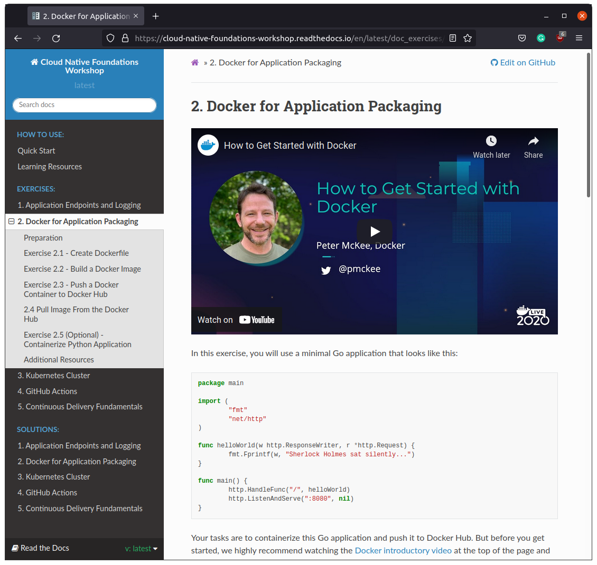

# Welcome to Cloud Native Foundations Workshop!

[](https://cloud-native-foundations-workshop.readthedocs.io/en/latest/?badge=latest)

*Learn how to structure, package, and release an application to a Kubernetes cluster using an automated CI/CD pipeline.*

## :zzz: About

[Cloud Native Foundations Workshop](https://cloud-native-foundations-workshop.readthedocs.io) is an educational guide for students learning cloud-native application development.

This learning guide relates to [SUSE Cloud Native Foundations Scholarship Program](https://www.udacity.com/scholarships/suse-cloud-native-foundations-scholarship)
from Udacity and covers all [hands-on exercises](https://github.com/udacity/nd064_course_1) in the Cloud Native Foundations Course.

## :dart: Objective

The main goal of this project is to build a knowledge base and help students solve technical issues outside the scope of the Cloud Native Foundation Course. 

## :card_file_box: Content

The workshop contains exercises and solutions on selected topics that will help you understand the basics of building, deploying, and maintaining cloud-native applications. This is NOT a comprehensive guide, but rather a focused look at a few key topics:

- Flask web development best practices.
- App containerization with Docker.
- Releasing applications to a Kubernetes cluster.
- Automation software development workflows with GitHub Actions.
- Using ArgoCD to build reliable CI/CD pipelines.

## :inbox_tray: Documentation

The documentation is the core of the workshop. You can [generate](#blue_book-generate-docs) it automatically with a single line of code and use it locally without internet access. Moreover, you can edit and improve documentation, contributing to this project, or build your own knowledge base. You can also download the documentation in the following formats:

- [PDF](https://cloud-native-foundations-workshop.readthedocs.io/_/downloads/en/latest/pdf/)
- [ePub](https://cloud-native-foundations-workshop.readthedocs.io/_/downloads/en/latest/epub/)
- [Zipped HTML](https://cloud-native-foundations-workshop.readthedocs.io/_/downloads/en/latest/htmlzip/)

Find out the online version of [Cloud Native Foundations Workshop on the Read the Docs](https://cloud-native-foundations-workshop.readthedocs.io).

<div align="center">
    
</div>

## :man_student: Required Knowledge

- Python
- Flask web development (introductory level)
- Networking (REST, protocols, HTTP methods)
- Git (basic commands, working with remote repositories)
- Linux shell commands

## :computer: Required Tools

- [x] IDE of your choice ([VS Code](https://code.visualstudio.com), [Sublime](https://www.sublimetext.com/), etc.)
- [x] [Python](https://www.python.org/downloads/)
- [x] [Git](https://git-scm.com/downloads)
- [x] [Docker](https://docs.docker.com/get-docker/)
- [x] [VirtualBox 6.1.16 +](https://www.virtualbox.org/wiki/Downloads)
- [x] [Vagrant](https://www.vagrantup.com/downloads)

## :open_file_folder: Project Organization (main tree)

    │
    ├── docs               <- Workshop documetation
    ├── exercises          <- Boilerplate code for exercises
    ├── solutions          <- Complete solution code
    │
    ├── .gitignore         <- Set of patterns for files/directories to ignore
    ├── .readthedocs.yaml  <- Read the Docs configuration file
    ├── LICENSE            <- License information
    ├── README.md          <- The top-level README for developers
    ├── requirements.txt   <- The requirements file for reproducing environment
    ├── test_env.py        <- Script to test Python environment setup
    │
    └── Vagrantfile        <- Virtual machine config file (base template)

## :rocket: How to Get Started

At the moment, the workshop includes two main sections: exercises and solutions. The quickest way to get started is to open the [Cloud Native Foundations Workshop on the Read the Docs](https://cloud-native-foundations-workshop.readthedocs.io) and walk through the tutorial. There you will find everything you need to get the job done and create your own cloud-native development solutions. 

#### :inbox_tray: Obtain Data

1. Fork the workshop repository.
2. On GitHub, navigate to **your fork** of the workshop repository and copy the URL.
3. Clone forked repository to your local machine using `git clone` command. It will look like this, with your GitHub username instead of `YOUR_USERNAME`:

```shell
git clone https://github.com/YOUR_USERNAME/cloud-native-foundations
```

**See details on** [how to fork and clone the repository.](https://docs.github.com/en/get-started/quickstart/fork-a-repo)

#### :gear: Set Up Environment

1. Open the workshop folder with IDE and run terminal.
2. Create the virtual environment: `python3 -m venv venv`
3. Activate the virtual environment: `source venv/bin/activate`
4. Install dependencies: `pip install -r requirements.txt`

#### :blue_book: Generate Docs

1. Change the working directory to docs: `cd docs`
2. Generate a local copy of workshop documentation by running `make html`
3. Open the local copy of the documentation in a web browser: `firefox build/html/index.html`

#### :100: Now you have everything you need to get the most out of this workshop! :tada:
